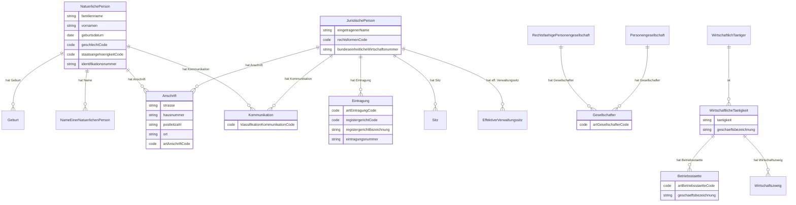
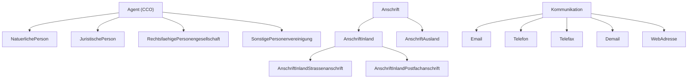
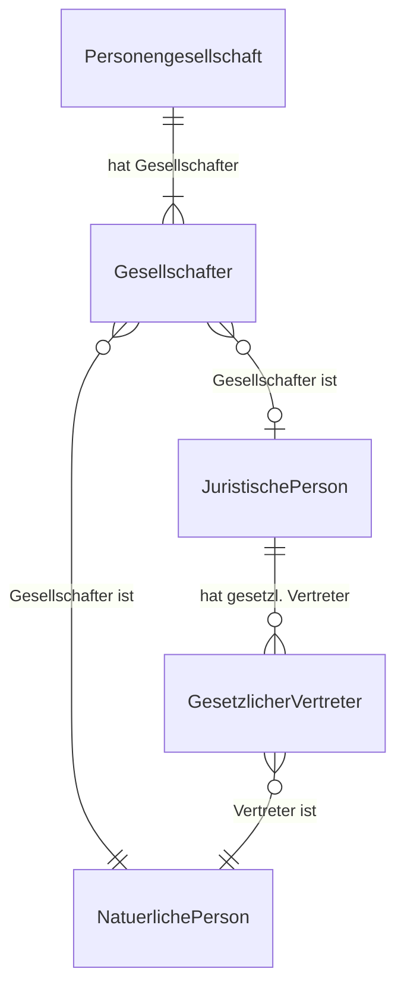
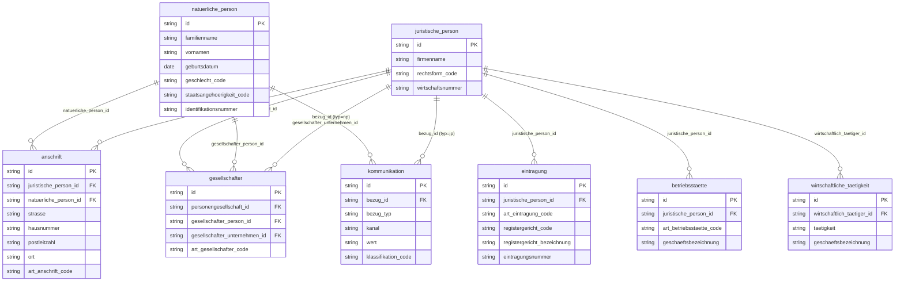
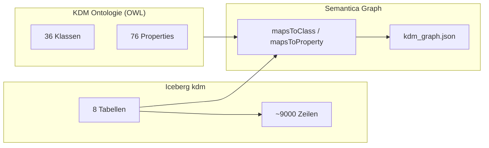
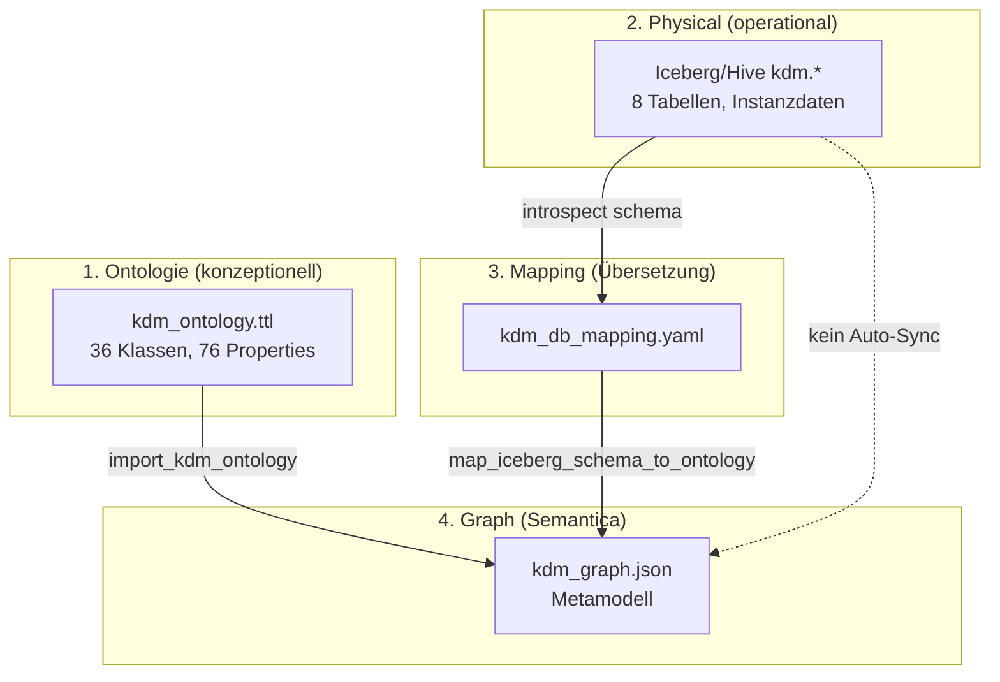
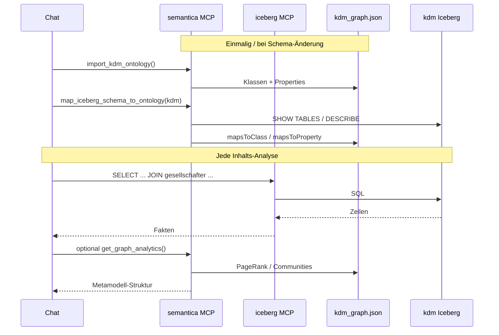

# KDM Entity-Relationship Model

XUnternehmen.Kerndatenmodell (KDM) v1.2 — `https://w3id.org/kdm/`

This document describes two layers:

1. **Conceptual ERM** — official KDM ontology (OWL classes & object properties)
2. **Physical ERM** — Iceberg/Hive implementation in database `kdm` (8 tables)

Semantica maps physical → conceptual via `config/kdm_db_mapping.yaml`.

---

## 1. Conceptual ERM (KDM Ontologie)

### 1.1 Kern-Entitäten (Agenten)



### 1.2 Vererbung (Auszug)



### 1.3 Rollen-Muster (KDM)

KDM modelliert Beteiligungen und Rollen als **eigenständige Klassen** mit Verweis auf die tragende Person:

| Rolle (Klasse) | Object Property | Träger (Range) |
|---|---|---|
| `Gesellschafter` | `gesellschafterID` | `NatuerlichePerson` \| `JuristischePerson` \| `RechtsfaehigePersonengesellschaft` |
| `GesetzlicherVertreter` | `gesetzlicherVertreterID` | `NatuerlichePerson` \| `JuristischePerson` |
| `Ansprechpartner` | `ansprechpartnerID` | `NatuerlichePerson` |
| `Antragsteller` | `antragstellerID` | Agent-Union |
| `HandelndePerson` | `handelndePersonID` | Agent-Union |
| `WirtschaftlichTaetiger` | — | `JuristischePerson` \| … |



---

## 2. Physical ERM (Iceberg `kdm` — implementiert)

Vereinfachtes relationales Schema für Demo/Analytics. PK = `id` (STRING).



### Kardinalitäten (Physical)

| Beziehung | Kardinalität | Hinweis |
|---|---|---|
| Person → Anschrift | 1:N | XOR: NP **oder** JP pro Zeile |
| JP → Eintragung | 1:N | HRB/HRA-Einträge |
| JP → Betriebsstätte | 1:N | Standorte |
| JP → Wirtschaftliche Tätigkeit | 1:N | Branchen |
| Personengesellschaft → Gesellschafter | 1:N | NP oder JP als Beteiligter |
| Agent → Kommunikation | 1:N | Polymorph via `bezug_typ` |

---

## 3. Mapping Conceptual ↔ Physical

| Physical (Tabelle) | KDM-Klasse | URI |
|---|---|---|
| `natuerliche_person` | `NatuerlichePerson` | `https://w3id.org/kdm/NatuerlichePerson` |
| `juristische_person` | `JuristischePerson` | `https://w3id.org/kdm/JuristischePerson` |
| `anschrift` | `Anschrift` | `https://w3id.org/kdm/Anschrift` |
| `eintragung` | `Eintragung` | `https://w3id.org/kdm/Eintragung` |
| `betriebsstaette` | `Betriebsstaette` | `https://w3id.org/kdm/Betriebsstaette` |
| `kommunikation` | `Kommunikation` | `https://w3id.org/kdm/Kommunikation` |
| `gesellschafter` | `Gesellschafter` | `https://w3id.org/kdm/Gesellschafter` |
| `wirtschaftliche_taetigkeit` | `WirtschaftlicheTaetigkeit` | `https://w3id.org/kdm/WirtschaftlicheTaetigkeit` |

### Abweichungen Physical vs. vollständiges KDM

| KDM-Konzept | Status in `kdm` DB |
|---|---|
| `Geburt`, `NameEinerNatuerlichenPerson` | In NP-Tabelle denormalisiert (`geburtsdatum`, `vornamen`/`familienname`) |
| `Email`, `Telefon`, `WebAdresse` | In `kommunikation.kanal` + `wert` vereinheitlicht |
| `Personengesellschaft` | Implizit über `juristische_person` + `gesellschafter` |
| `GesetzlicherVertreter`, `Ansprechpartner`, `Antrag` | Nicht implementiert (nur Ontologie) |
| `Sitz`, `EffektiverVerwaltungssitz` | Nicht als eigene Tabelle |
| `Wirtschaftszweig` | In `wirtschaftliche_taetigkeit.taetigkeit` |

---

## 4. Gesamtarchitektur (Semantica + Iceberg)



- **Iceberg MCP** — SQL auf Physical ERM (Fakten)
- **Semantica MCP** — Ontologie + Mapping (Bedeutung)
- **Gemeinsam** — KDM als semantische Schicht über dem Data Lake

---

## 5. Architektur & MCP-Grenzen

Wie Ontologie, Mapping, Graph und Physical zusammenpassen — und welcher MCP welche Rolle in der Analyse übernimmt.

### 5.1 Die vier Schichten



| Schicht | Artefakt | Inhalt | Ändert sich wenn … |
|---|---|---|---|
| **Ontologie** | `data/kdm_ontology.ttl` | XÖV-KDM-Bedeutung: Klassen, Properties, Rollen | KDM-Release aktualisiert wird |
| **Physical** | `kdm.*` in Hive | Instanzen: Personen, Firmen, Adressen, Beteiligungen | ETL, Bulk-Seed, SQL INSERT |
| **Mapping** | `config/kdm_db_mapping.yaml` | Brücke: Tabelle/Spalte → KDM-URI | YAML editiert wird |
| **Graph** | `data/kdm_graph.json` | Metamodell: Ontologie + Schema-Mappings | `import_*` / `map_*` ausgeführt wird |

### 5.2 Verknüpfung der Schichten

**Ontologie → Graph** (`import_kdm_ontology`)

- Materialisiert `OntologyClass`- und Property-Knoten mit `subClassOf`, `definedIn`, `domain`, `range`
- Enthält **keine** Firmen- oder Personeninstanzen

**Physical → Mapping → Graph** (`map_iceberg_schema_to_ontology`)

1. Hive-Introspection (`SHOW TABLES`, `DESCRIBE`)
2. Heuristik (Tabellenname ≈ Klassenname) + explizite YAML-Regeln
3. Optional `apply_mappings: true` → Graph-Knoten

Beispielpfad im Graph (Schema-Ebene, 2–3 Hops):

```
db:table:gesellschafter  --mapsToClass-->   kdm:Gesellschafter
db:table:gesellschafter  --hasColumn-->    db:column:gesellschafter.personengesellschaft_id
kdm:Anschrift            --references-->   kdm:JuristischePerson   (FK-Inferenz)
```

**Physical → Instanzen** (bleiben in Iceberg)

- Zeilen wie `np-00013` (Peter Meyer) existieren **nur** in `kdm.natuerliche_person`
- Es gibt **keinen automatischen Pfad** Graph-Knoten → Iceberg-Zeile
- Verbindung läuft indirekt: Graph erklärt Semantik → SQL nutzt Spaltennamen/FKs

### 5.3 MCP-Verantwortlichkeiten

#### `iceberg-mcp-server-hive` — Fakten & Instanzen

| Tool | Funktion |
|---|---|
| `execute_query` | SQL: JOINs, Filter (z. B. PLZ `80%`), Aggregationen (Hub ≥ 3 Firmen) |
| `get_schema` | Tabellennamen in `kdm` |
| `list_databases` | Datenbank-Übersicht |
| `list_iceberg_snapshots` | Iceberg-Versionierung |

**Stärke:** Beliebig tiefe relationale Pfade — JOIN-Tiefe nur durch die SQL-Query begrenzt.

**Grenze:** Kein KDM-Vokabular, nur Spalten- und Tabellennamen.

#### `semantica` MCP — Bedeutung & Metamodell

| Tool | Funktion |
|---|---|
| `import_kdm_ontology` | KDM-Ontologie in den Graph laden |
| `map_iceberg_schema_to_ontology` | One-Shot: Hive-Schema + KDM + Mapping |
| `map_db_schema_to_ontology` | Mapping mit vorgegebenem `schema_info` |
| `get_hive_schema_info` | Schema-Introspection (impyla, `HIVE_*`) |
| `get_graph_summary` | Knoten-/Decision-Count |
| `get_graph_analytics` | PageRank, Community Detection auf dem Graph |
| `export_graph` | Turtle / JSON-LD des Metamodells |
| `extract_entities` / `extract_relations` | Text → Entities (nicht Iceberg-Daten) |
| `get_causal_chain` | Kausalketten bei Decisions (`max_depth` default 5) |

**Stärke:** Erklärt, *warum* eine Spalte semantisch zu welcher KDM-Klasse/Property gehört.

**Grenze:** Graph enthält **keine** Instanzdaten aus Iceberg.

### 5.4 Kombinierter Analyse-Ablauf



| Schritt | MCP | Suchtiefe |
|---|---|---|
| KDM-Klassen laden | Semantica | 1× Ontologie-Import |
| Schema → KDM | Semantica | 1 Hop pro Tabelle/Spalte (flach) |
| Hub / Filter auf Inhalten | Iceberg | SQL-JOINs (praktisch unbegrenzt) |
| Ergebnis in KDM erklären | Semantica + Chat | 1–3 Hops im Metamodell-Graph |
| Struktur-Metriken | Semantica | Gesamtgraph (~153 Knoten) |

### 5.5 Grenzen im Detail

#### Graph-Tiefe vs. SQL-Tiefe

| Aspekt | Semantica-Graph | Iceberg-SQL |
|---|---|---|
| Durchsuchtes Material | Ontologie + Schema-Mappings | Instanzdaten |
| Typische Pfadlänge | 1–3 Hops (`table → class → subClassOf`) | 2–6 JOINs in Netzwerk-Analysen |
| Explizites Hop-Limit | Kein MCP-Tool für `get_neighbors(hops=N)` | Kein Limit (außer Query-Komplexität) |
| Global Analytics | PageRank / Louvain über alle Graph-Knoten | — |
| Kausalketten | `get_causal_chain`: default **5**, max **100** — nur für **Decisions** | — |

`ContextGraph.get_neighbors(hops=…)` existiert im Python-API, ist aber **nicht als MCP-Tool exponiert**.

#### Was im Graph ist — und was nicht

| Im Graph (`kdm_graph.json`) | Nicht im Graph |
|---|---|
| 36 `OntologyClass` | Personen-/Firmenzeilen |
| 76 Properties | PLZ-Filterergebnisse |
| 8 `DatabaseTable` | Co-Gesellschafter-Netzwerk als Instanzen |
| 14 `DatabaseColumn` | SQL-Query-Ergebnisse |
| Mapping-Kanten | — |

**Needle-in-haystack auf Inhalten** → Iceberg.  
**Needle semantisch einordnen** → Semantica.

#### Mapping-Abdeckung (Stand Demo)

| Metrik | Wert |
|---|---|
| Tabellen gemappt | 8 / 8 (explizit) |
| Spalten im Graph (`mapsToProperty`) | 14 / 44 |
| Spalten mit Namens-Hinweis (Heuristik) | 27 / 44 |
| FK → Ontologie-Klasse | 4 Kanten |

Nicht als eigene Physical-Tabellen: `GesetzlicherVertreter`, `Antrag`, `Sitz`, `Geburt` (nur Ontologie).

#### Persistenz & Sync

| Thema | Verhalten |
|---|---|
| Graph laden | `SEMANTICA_KG_PATH` beim MCP-Start (`load_from_file`) |
| Graph speichern | Nicht automatisch nach Tool-Calls — `export_graph` oder `save_to_file` |
| Iceberg → Graph | **Kein Auto-Sync** — neue Zeilen ändern den Graph nicht |
| Schema-Änderung | `map_iceberg_schema_to_ontology` erneut ausführen |
| Ontologie-Update | `import_kdm_ontology` erneut ausführen |

#### Bekannte technische Hinweise

- `get_graph_analytics()` / PageRank kann mit `ContextGraph` fehlschlagen — Workaround: Analytics auf exportiertem JSON (NetworkX)
- `import_kdm_ontology` per URL: SSL-Probleme möglich → lokale `data/kdm_ontology.ttl` verwenden
- MCP ohne geladenen Graph: `get_graph_summary` zeigt 0 Knoten trotz vorhandener `kdm_graph.json` → MCP neu starten, `SEMANTICA_KG_PATH` prüfen

### 5.6 Merksatz

```
Physical (Iceberg)  = WAS ist in den Daten?         → iceberg-mcp, SQL
Ontologie (OWL)     = WAS bedeutet es (XÖV/KDM)?    → semantica, import_kdm_ontology
Mapping (YAML)      = WIE heißt Physical in KDM?   → semantica, map_*_to_ontology
Graph (JSON)        = Metamodell (Schema + Ontologie) → semantica, Analytics (~153 Knoten)
```

Volle KDM-Analyse = **Iceberg für Instanzen** + **Semantica für Semantik** + Agent, der beides verbindet.

---

## Referenzen

- Ontologie: `data/kdm_ontology.ttl` (oder https://w3id.org/kdm/)
- DDL: `deploy/iceberg/kdm_ddl.sql`
- Mapping: `config/kdm_db_mapping.yaml`
- Graph: `data/kdm_graph.json`
