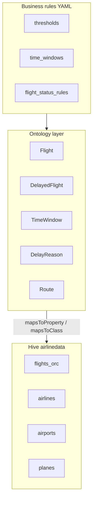

# Airline ontology — proposed business logic

Extension of `https://w3id.org/demo/airline#` with **operational semantics** that agents use for analytics. Raw data stays in `flights`; business concepts are **derived** via rules (not new Hive columns required for v1).

**Artifacts**

| File | Role |
|---|---|
| `data/airline_business_ontology.ttl` | OWL classes: routes, time windows, delay taxonomy, KPIs |
| `config/airline_business_rules.yaml` | Executable thresholds, SQL-friendly rules |
| `config/airline_r2rml_db_mapping.yaml` | Physical column bindings (already has delay fields) |

---

## 1. Design principle — runtime SQL, no Hive view

```text
Ontology term          Business rules YAML           Runtime SQL (per query)
─────────────          ───────────────────           ───────────────────────
OnTimeFlight           flight_status_rules           CASE ON flights …
MorningPeak            time_windows                  CASE ON crsdeptime …
primaryDelayReason     delay_reason_priority         CASE ON carrierdelay …
operatedBy             object property joins         JOIN airlines ON …
```

**Nothing is pre-materialized in Hive** for business logic. The agent:

1. Reads ontology + `airline_graph.json` (what exists physically).
2. Reads `airline_business_rules.yaml` (how to interpret it).
3. Emits SQL with inline subqueries, `CASE`, and `JOIN`s at **query time**.

```python
resolver.flight_runtime_from()  # → (SELECT … CASE … FROM flights) f
resolver.join_sql("operatedBy") # → JOIN airlines a ON …
```

---

## 2. Logistics & network

### Concepts

| Class | Meaning | Derivation |
|---|---|---|
| `Route` | Directed O–D pair | `CONCAT(origin,'-',dest)` |
| `operatesOnRoute` | Flight → Route | `Flight.origin` + `Flight.dest` |
| `HubAirport` | High-volume origin | Top-N airports by departures in reference year |
| `routeDistanceMiles` | Great-circle proxy | `Flight.distance` aggregated on route |

### Business rules

- **Route frequency** — rank routes by `COUNT(Flight)` per year; identifies trunk logistics.
- **Hub detection** — airport is `HubAirport` if departures ≥ P90 of all airports (or fixed top 20).
- **Aircraft rotation** — same `Plane.tailNum` on consecutive `Flight` rows (by date/time) → turnaround logistics (needs window functions; ontology term: `assignedAircraft` chain).

### Example question (ontology-first)

> "Which routes from hub airports have the worst on-time performance in morning peak?"

Classes: `HubAirport`, `Route`, `MorningPeak`, `OnTimeFlight`, `DelayedFlight`.

---

## 3. Peak business hours

DOT `crsDepTime` / `depTime` are **local airport time** as integer HHMM (e.g. `1530` = 15:30).

### Time windows (proposed)

| Ontology class | Local time | `crsDepTime` range |
|---|---|---|
| `MorningPeak` | 06:00–09:59 | 600–959 |
| `Midday` | 10:00–16:59 | 1000–1659 |
| `EveningPeak` | 17:00–20:59 | 1700–2059 |
| `Overnight` | 21:00–05:59 | 2100–2359 or 0–559 |

Property: `Flight.scheduledInWindow` → `TimeWindow`.

### SQL pattern (agent-generated from rules)

```sql
CASE
  WHEN f.crsdeptime BETWEEN 600 AND 959 THEN 'MorningPeak'
  WHEN f.crsdeptime BETWEEN 1000 AND 1659 THEN 'Midday'
  WHEN f.crsdeptime BETWEEN 1700 AND 2059 THEN 'EveningPeak'
  ELSE 'Overnight'
END AS time_window
```

### Business use cases

- **Staffing** — compare `DelayedFlight` rate in `EveningPeak` vs `Midday`.
- **OTP by window** — KPI `OnTimePerformance` grouped by `scheduledInWindow`.
- **Day-of-week** — combine `dayOfWeek` (1=Mon in DOT) with `TimeWindow` for weekday morning peaks.

---

## 4. Delay reasons & severity

### FAA on-time vs delayed

| Class | Rule |
|---|---|
| `OnTimeFlight` | `cancelled=0` AND `arrDelay≤15` AND `depDelay≤15` |
| `DelayedFlight` | `cancelled=0` AND (`arrDelay>15` OR `depDelay>15`) |
| `CancelledFlight` | `cancelled=1` |
| `DivertedFlight` | `diverted` in (`'1'`,`'Y'`) |

Threshold: **15 minutes** (`config/airline_business_rules.yaml` → `on_time_max_delay`).

### Severity (on `DelayedFlight`)

| Class | Minutes (max of arr/dep delay) |
|---|---|
| `MinorDelay` | 16–30 |
| `ModerateDelay` | 31–60 |
| `SevereDelay` | > 60 |

### DOT delay attribution (already in `flights_orc`)

| Ontology class | Column | Meaning |
|---|---|---|
| `CarrierDelayReason` | `carrierdelay` | Airline-controlled |
| `WeatherDelayReason` | `weatherdelay` | Weather |
| `NASDelayReason` | `nasdelay` | ATC / system capacity |
| `SecurityDelayReason` | `securitydelay` | Security |
| `LateAircraftDelayReason` | `lateaircraftdelay` | Incoming aircraft late |

**`primaryDelayReason`** — ontology property; compute as argmax of the five columns (tie-break: Carrier → Weather → NAS → Security → Late aircraft).

Optional reification: `DelayBreakdown` node per delayed flight with `breakdownCarrierMinutes`, etc. (useful for graph export; not required for SQL analytics).

### Cancellation codes

`cancellationCode` on `Flight` — extend with `skos:notation` individuals (DOT codes A–Z) in a future ontology patch.

---

## 5. KPIs (named analytics concepts)

| KPI class | Definition | Typical slice |
|---|---|---|
| `OnTimePerformance` | `|OnTimeFlight| / |completed Flight|` | carrier, route, time window |
| `AverageArrivalDelay` | `AVG(arrDelay)` on non-cancelled flights | airport, year |
| `DelayAttributionShare` | `SUM(cause_delay) / SUM(all cause delays)` | carrier, `DelayReason` |

These are **not stored** in Semantica graph row data — they are query templates agents bind to ontology terms.

---

## 6. Architecture (layers)



---

## 7. Implementation status

| Step | Artifact | Status |
|---|---|---|
| Merge ontologies | `scripts/build_airline_graph.py` → `data/airline_graph.json` (254 nodes) | Done |
| Business rules | `config/airline_business_rules.yaml` | Done |
| SQL builders | `examples/airline_business_sql.py` | Done |
| Resolver | `examples/airline_ontology_resolver.py` (`flight_runtime_from`, `join_sql`) | Done |
| Runtime SQL | `examples/airline_business_sql.py` | Done |
| Demos 5–7 | `examples/airline_ontology_analytics_demo.py` | Done |

```bash
python scripts/build_airline_graph.py
python examples/airline_ontology_analytics_demo.py --list-runtime
python examples/airline_ontology_analytics_demo.py --demo 5 --print-sql-only
python examples/airline_ontology_analytics_demo.py --demo 5   # executes on Hive
```

Optional Hive view (`deploy/iceberg/airline_flight_enriched.sql`) is **not** used by Semantica.

---

## 8. Demo chat ideas (business logic)

| User question | Ontology terms |
|---|---|
| "OTP in evening peak for AA vs WN" | `OnTimePerformance`, `EveningPeak`, `operatedBy` |
| "Top delay cause for severe delays at ORD" | `SevereDelay`, `primaryDelayReason`, `originAirport` |
| "Busiest logistics routes under 500 miles" | `Route`, `routeDistanceMiles`, `operatesOnRoute` |
| "Is weather or carrier delay worse on Mondays?" | `WeatherDelayReason`, `CarrierDelayReason`, `dayOfWeek` |
