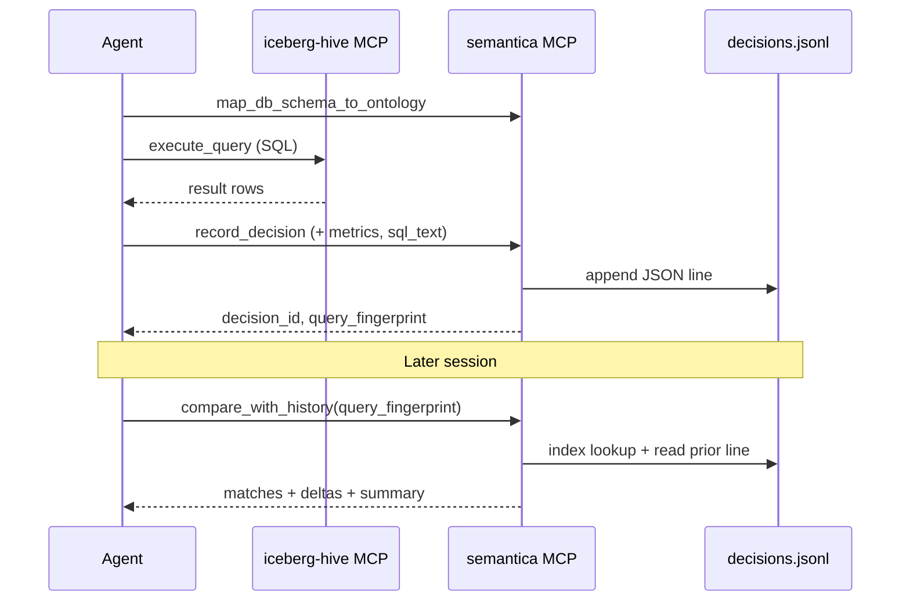

Agent workflows that run SQL analytics, apply business rules, and record conclusions produce **large, repetitive payloads** (result sets, full reasoning traces, session metadata). Storing those verbatim as graph nodes makes `SEMANTICA_KG_PATH` files grow quickly and slows graph load in MCP cold starts.

The **Decision Store** is a companion persistence layer: append-only JSONL on disk, optional SQLite index for fast lookup, and slim records keyed by **query fingerprints**. The knowledge graph keeps ontology, entities, and relationships; the store keeps the audit trail. **Decisions are never written to the graph** — not as full nodes, not as slim references.

<Info>
  Implemented in `semantica/decision_store/` and wired to MCP tools. `record_decision` appends to JSONL only — no graph mutation. Set `SEMANTICA_DECISION_STORE` for a persistent path (default: `~/.semantica/decisions`).
</Info>

## Decision Store vs. Knowledge Graph

| Concern | Knowledge Graph (`SEMANTICA_KG_PATH`) | Decision Store (`SEMANTICA_DECISION_STORE`) |
|--------|----------------------------------------|---------------------------------------------|
| Primary role | Ontology, entities, relationships, causal topology | Append-only audit log of agent decisions |
| Record size | Small nodes + edges; large blobs discouraged | Slim JSON lines; optional external blob refs |
| Query pattern | Graph traversal, precedent similarity, SHACL | Time-range scan, fingerprint match, metric diff |
| MCP cold start | Loads full graph JSON | Streams/indexes only what you query |
| Best for | "What entities exist? What caused what?" | "What did we decide last month? Did the answer change?" |

See also [Decision Intelligence](./decision-intelligence.md) for graph-native decision APIs and [MCP Server](./mcp-server.md) for current tool wiring.

---

## Storage Layout

```
${SEMANTICA_DECISION_STORE}/
├── decisions.jsonl          # append-only canonical log (one JSON object per line)
├── index.sqlite             # optional; built on first query or via `semantica decision-store reindex`
└── blobs/                   # optional; large artifacts referenced by blob_ref
    └── {sha256}.json
```

**Default path** (when env var unset):

```
~/.semantica/decisions/
```

For Cloudera Agent Studio, the MCP sandbox mounts **`/workflow_data` read-only**
(inputs only). The **writable** location is **`/workspace`** (session artifacts):

```bash
SEMANTICA_DECISION_STORE=/workspace/decisions
```

Decisions appear under session artifacts in the Agent Studio UI. For long-term
workflow-level archive, copy `decisions.jsonl` from the session directory on the
host (or use Iceberg `decision_audit` in CDW deployments).

### JSONL append semantics

- Each line is a self-contained UTF-8 JSON object terminated by `\n`.
- Writes are **append-only**; corrections use a new line with `supersedes: "<prior decision_id>"`.
- Readers must tolerate partial lines (crash mid-write); the last incomplete line is ignored on replay.
- File rotation (optional): `decisions-2025-09.jsonl` with a symlink `decisions.jsonl` → current month.

---

## Record Schema

Every record is a JSON object. Required fields are marked **R**; recommended **Rec**; optional **O**.

### Core identity

| Field | | Description |
|-------|---|-------------|
| `decision_id` | **R** | UUID v4, unique within the store |
| `recorded_at` | **R** | ISO-8601 UTC timestamp |
| `schema_version` | **R** | Store schema version, e.g. `"1.0"` |
| `supersedes` | O | Prior `decision_id` if this record replaces/corrects one |

### Decision content (compatible with current MCP `record_decision`)

| Field | | Description |
|-------|---|-------------|
| `category` | **R** | e.g. `airline_analytics`, `loan_approval` |
| `scenario` | **R** | Natural-language situation description |
| `reasoning` | **R** | Why the decision/outcome was chosen |
| `outcome` | **R** | e.g. `approved`, `top5_airports_2005` |
| `confidence` | **R** | Float 0–1 |
| `decision_maker` | Rec | Agent name, user id, or model id |
| `valid_from` | O | ISO date |
| `valid_until` | O | ISO date |

### Session & provenance

| Field | | Description |
|-------|---|-------------|
| `session_id` | Rec | Agent Studio / MCP session id |
| `agent_id` | O | Workflow or agent definition id |
| `tool_chain` | O | Ordered list of MCP tool names invoked before record |
| `source_refs` | O | URIs or paths to inputs (contracts, ontologies) |

### Query fingerprint (analytics workflows)

Used by `compare_with_history` to find "the same question" across runs even when wording differs slightly.

| Field | | Description |
|-------|---|-------------|
| `query_fingerprint` | Rec | Stable hash (see below) |
| `query_intent` | Rec | Normalized intent string, e.g. `midday_departures_top_airports_by_year` |
| `query_params` | Rec | Structured filters: `{"year": 2005, "metric": "departure_count", "top_k": 5}` |
| `sql_hash` | Rec | SHA-256 of normalized SQL (whitespace-stripped, lowercase keywords) |
| `sql_text` | O | Full SQL; omit if large — store in `blobs/` and set `sql_blob_ref` |
| `business_rules_hash` | Rec | SHA-256 of merged business-rules YAML at decision time |
| `ontology_mapping_hash` | O | SHA-256 of R2RML / DB mapping config |

### Result summary (never full result sets in the main line)

| Field | | Description |
|-------|---|-------------|
| `result_metrics` | Rec | Slim key figures, e.g. `{"ATL": 142003, "ORD": 128441, ...}` |
| `result_row_count` | O | Integer |
| `result_checksum` | O | Hash of sorted result rows for exact equality checks |
| `result_blob_ref` | O | Path under `blobs/` if full CSV/JSON archived |

### Causal linkage (store-internal)

| Field | | Description |
|-------|---|-------------|
| `causal_parent_ids` | O | Other `decision_id`s in the store that preceded this decision |

### Example record

```json
{
  "decision_id": "a1b2c3d4-e5f6-7890-abcd-ef1234567890",
  "recorded_at": "2025-09-30T11:45:00Z",
  "schema_version": "1.0",
  "category": "airline_analytics",
  "scenario": "Midday departures analysis for top 5 US airports in 2005",
  "reasoning": "Filtered flights 11:00–13:59 local, grouped by origin airport, ranked by count.",
  "outcome": "ATL, ORD, DFW, IAH, LAX",
  "confidence": 0.92,
  "decision_maker": "airline-sql-agent",
  "session_id": "cas-session-20250930-001",
  "query_fingerprint": "fp:sha256:8f3a…c21d",
  "query_intent": "midday_departures_top_airports_by_year",
  "query_params": {"year": 2005, "hour_start": 11, "hour_end": 13, "top_k": 5, "country": "US"},
  "sql_hash": "sha256:91e2…004b",
  "business_rules_hash": "sha256:4c11…aa90",
  "result_metrics": {"ATL": 142003, "ORD": 128441, "DFW": 119887, "IAH": 98234, "LAX": 95102},
  "result_row_count": 5,
  "result_checksum": "sha256:b7d4…1190",
  "tool_chain": ["map_db_schema_to_ontology", "execute_query", "record_decision"]
}
```

---

## Query Fingerprint Algorithm

Goal: two runs of "the same analytical question" yield the same fingerprint even if the agent paraphrases `scenario`.

**Inputs** (canonical JSON, keys sorted):

```json
{
  "intent": "<query_intent or derived slug>",
  "params": { "...": "normalized param object" },
  "sql_hash": "<sha256 of normalized SQL>",
  "rules_hash": "<business_rules_hash>",
  "mapping_hash": "<ontology_mapping_hash or null>"
}
```

**Algorithm:**

1. Serialize inputs with `json.dumps(..., sort_keys=True, separators=(",", ":"))`.
2. `query_fingerprint = "fp:sha256:" + sha256(canonical).hexdigest()[:16]`.

**Intent derivation** (when agent omits `query_intent`):

- Lowercase, strip punctuation, collapse whitespace on `category + " " + first 120 chars of scenario`.
- Or: LLM/tool extracts a slug — stored explicitly on record for stability.

**Param normalization:**

- Sort list values; cast numeric strings to numbers; drop session-specific ids.
- Exclude `session_id`, `recorded_at`, `decision_id` from fingerprint inputs.

---

## SQLite Index (optional)

<Info>
  **Kein SQLite-Server nötig.** SQLite ist eine eingebettete Datei-Datenbank — kein Daemon, kein Port, keine separate Installation auf dem Workbench. Der MCP-Prozess öffnet schreibend die lokale Datei `${SEMANTICA_DECISION_STORE}/index.sqlite` über Pythons Standardbibliothek `sqlite3` (auf macOS/Linux meist vorinstalliert). Wenn SQLite wirklich fehlt, setze `SEMANTICA_DECISION_STORE_INDEX=none` — dann scannt `compare_with_history` die JSONL-Datei direkt (langsamer, aber ohne Abhängigkeit).
</Info>

Built lazily from JSONL on first lookup. Enables sub-second queries by `query_fingerprint` or `query_intent` without reading the entire log on every call.

**Why two files?** JSONL remains the **source of truth** (append-only, human-readable, git-friendly). SQLite is a **derived cache**: slim columns + byte offset into JSONL. On crash, delete `index.sqlite` and it rebuilds from `decisions.jsonl`.

**Lookup flow:**

1. `compare_with_history` receives `query_fingerprint` (or `query_intent`).
2. SQLite: `SELECT decision_id, json_line_offset FROM decisions WHERE query_fingerprint = ? ORDER BY recorded_at DESC LIMIT 5` — milliseconds even for 100k records.
3. For each hit, seek to `json_line_offset` in `decisions.jsonl`, read one line, parse full JSON (reasoning, `result_metrics`, etc.).
4. Compute deltas between current and prior `result_metrics`.

```sql
CREATE TABLE decisions (
  decision_id       TEXT PRIMARY KEY,
  recorded_at       TEXT NOT NULL,
  category          TEXT,
  query_fingerprint TEXT,
  query_intent      TEXT,
  sql_hash          TEXT,
  outcome           TEXT,
  confidence        REAL,
  session_id        TEXT,
  supersedes        TEXT,
  json_line_offset  INTEGER NOT NULL  -- byte offset in decisions.jsonl
);

CREATE INDEX idx_fingerprint ON decisions(query_fingerprint, recorded_at DESC);
CREATE INDEX idx_intent       ON decisions(query_intent, recorded_at DESC);
CREATE INDEX idx_category     ON decisions(category, recorded_at DESC);
CREATE INDEX idx_session      ON decisions(session_id);
```

Full record body is read from JSONL via `json_line_offset` when needed.

---

## Environment Variables

| Variable | Default | Description |
|----------|---------|-------------|
| `SEMANTICA_DECISION_STORE` | `~/.semantica/decisions` | Root directory for JSONL + index |
| `SEMANTICA_DECISION_STORE_INDEX` | `auto` | `auto` \| `sqlite` \| `none` |
| `SEMANTICA_DECISION_BLOB_MAX_INLINE` | `8192` | Max bytes for `result_metrics` / SQL inline before blob offload |

Existing vars unchanged:

| Variable | Role |
|----------|------|
| `SEMANTICA_KG_PATH` | Ontology graph JSON (not the decision log) |
| `SEMANTICA_MAPPING_CONFIG` | DB mapping YAML (hashed into `ontology_mapping_hash`) |

### Agent Studio example

```json
{
  "mcpServers": {
    "semantica": {
      "command": "uvx",
      "args": ["--from", "git+https://github.com/semantica/semantica", "semantica-mcp"],
      "env": {
        "SEMANTICA_KG_PATH": "/workflow_data/config/airline_graph.json",
        "SEMANTICA_MAPPING_CONFIG": "/workflow_data/config/airline_r2rml_db_mapping.yaml",
        "SEMANTICA_DECISION_STORE": "/workspace/decisions"
      }
    }
  }
}
```

---

## MCP Tool Sketches

These extend the current Semantica MCP toolset. Handlers live in `semantica/mcp_server/` (planned); behavior below is the **contract** agents and workflows should rely on.

### `record_decision` (extended)

**Behavior:**

1. Validate required fields (`category`, `scenario`, `reasoning`, `outcome`, `confidence`).
2. Accept optional analytics extensions: `query_intent`, `query_params`, `sql_text`, `result_metrics`, `tool_chain`, `session_id`.
3. Compute `query_fingerprint`, `sql_hash`, `business_rules_hash` server-side if not supplied.
4. Append one JSON line to `decisions.jsonl`.
5. Update SQLite index if enabled.
6. Return `{decision_id, query_fingerprint, recorded_at, store_path}`.

No graph mutation: `record_decision` does **not** call `_add_decision_to_graph` and does **not** touch `SEMANTICA_KG_PATH`.

**Input schema additions** (properties on existing tool):

```json
{
  "query_intent": {"type": "string"},
  "query_params": {"type": "object"},
  "sql_text": {"type": "string"},
  "result_metrics": {"type": "object"},
  "result_row_count": {"type": "integer"},
  "session_id": {"type": "string"},
  "tool_chain": {"type": "array", "items": {"type": "string"}},
  "decision_maker": {"type": "string"}
}
```

### `compare_with_history` (new)

Find prior decisions for the same or similar analytical intent and explain numeric deltas.

**Input:**

```json
{
  "query_fingerprint": "fp:sha256:8f3a…c21d",
  "query_intent": "midday_departures_top_airports_by_year",
  "query_params": {"year": 2005, "top_k": 5},
  "sql_text": "SELECT …",
  "category": "airline_analytics",
  "lookback_days": 90,
  "match_mode": "fingerprint",
  "limit": 5
}
```

`match_mode`:

- `fingerprint` — exact `query_fingerprint` match (default, fastest).
- `intent` — same `query_intent` + overlapping `query_params` (Jaccard on keys).
- `scenario` — embedding similarity on `scenario` text (fallback).

**Output:**

```json
{
  "current": {
    "decision_id": "…",
    "recorded_at": "2025-09-30T11:45:00Z",
    "result_metrics": {"ATL": 142003, "ORD": 128441}
  },
  "matches": [
    {
      "decision_id": "…",
      "recorded_at": "2025-08-15T09:12:00Z",
      "match_score": 1.0,
      "match_reason": "identical query_fingerprint",
      "result_metrics": {"ATL": 141890, "ORD": 128500},
      "delta": {
        "ATL": {"absolute": 113, "relative_pct": 0.08},
        "ORD": {"absolute": -59, "relative_pct": -0.05}
      },
      "sql_changed": false,
      "rules_changed": false
    }
  ],
  "summary": "Results stable within 0.1% vs. last run on 2025-08-15."
}
```

**Delta rules:**

- For numeric `result_metrics`: `absolute = current - prior`, `relative_pct = absolute / prior * 100` (null if prior is 0).
- For string/list `outcome`: set `outcome_changed: true` and optional `added` / `removed` lists.
- Set `sql_changed` when `sql_hash` differs; `rules_changed` when `business_rules_hash` differs.

### `explain_decision_delta` (new, optional)

Natural-language wrapper over `compare_with_history` for chat-oriented agents.

**Input:** `{ "decision_id": "…", "baseline_decision_id": "…" }` or `{ "decision_id": "…", "auto_baseline": true }`.

**Output:** `{ "explanation": "…", "structured_delta": { … } }` — agent may pass `structured_delta` to the LLM for narration.

---

## Typical Workflow



1. Agent runs SQL via **iceberg-hive** MCP (not Semantica).
2. Agent calls **`record_decision`** with slim `result_metrics`, not raw rows.
3. On a later run, agent calls **`compare_with_history`** before narrating changes to the user.
4. Optional: export store slice to Iceberg `decision_audit` table for enterprise DWH (see below).

---

## Enterprise Variant: Iceberg `decision_audit`

For CDW deployments, JSONL on the workbench can be **replicated** to Hive/Iceberg:

```sql
CREATE TABLE governance.decision_audit (
  decision_id         STRING,
  recorded_at         TIMESTAMP,
  category            STRING,
  query_fingerprint   STRING,
  query_intent        STRING,
  outcome             STRING,
  confidence          DOUBLE,
  result_metrics      STRING,  -- JSON
  sql_hash            STRING,
  business_rules_hash STRING,
  session_id          STRING,
  full_record         STRING   -- optional JSON line
) STORED AS ICEBERG;
```

MCP `compare_with_history` can query Iceberg when `SEMANTICA_DECISION_STORE_BACKEND=iceberg` (future); JSONL remains the edge/local default.

---

## Migration from In-Memory Graph Decisions

Today’s MCP session stores decisions only in the subprocess graph:

| Step | Action |
|------|--------|
| 1 | Set `SEMANTICA_DECISION_STORE` to a persistent path |
| 2 | Re-run workflows; new decisions append to JSONL only |
| 3 | Optional: export existing in-memory/graph decision nodes via `export_graph` and backfill JSONL with a one-off script |
| 4 | Use `compare_with_history` on the second run of each analytical template |

Store-backed MCP tools **`query_decisions`**, **`find_precedents`**, and **`get_causal_chain`** will read from the Decision Store (via SQLite index), not from the knowledge graph. Use `compare_with_history` for fingerprint-based history and delta explanation.

---

## Implementation Status

- [x] `semantica/decision_store/` — writer, fingerprint, SQLite index, compare, store facade
- [x] MCP: `record_decision`, `compare_with_history`, `explain_decision_delta`; store-backed `query_decisions`, `find_precedents`, `get_causal_chain`
- [x] Tests: `tests/decision_store/test_decision_store.py`
- [ ] CLI: `semantica decision-store reindex`, `semantica decision-store tail`
- [ ] Cross-link from [decision-intelligence.md](./decision-intelligence.md) and [mcp-server.md](./mcp-server.md)

---

## Related Guides

- [Decision Intelligence](./decision-intelligence.md) — graph-native decision nodes, causal chains, policy gating
- [MCP Server](./mcp-server.md) — tool catalog and env configuration
- [Agent Memory](./agent-memory.md) — external knowledge vs. internal decisions
- [Provenance](./provenance.md) — lineage for data artifacts referenced by decisions
